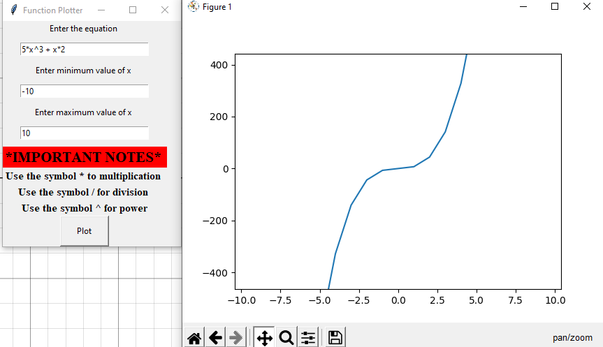

# FunctionPlotter

A simple GUI app to plot a user-entered function built using Tkinter, Python

##  RUN <a name = "Install"></a>

```
git clone https://github.com/Omaar2000/MasterMicro.git
```
```
cd gui\
```
```
task.py
```

##  Built Using <a name = "tech"></a>

- **PYTHON**
- **TkINTER**


## 📷 Screenshots
 <div name="Screenshots" align="center">                     
 </a> 
 <hr>                                                        
 </a>
 <hr>                                                        
 </a> 
 <hr>                                                        
 </a> 
 <hr>                                                        
 </a> 
 <hr>                                                        
 </a> 
 <hr>                                                        
 </a> 
 <hr>                                                        
 </a> 
 </div>
